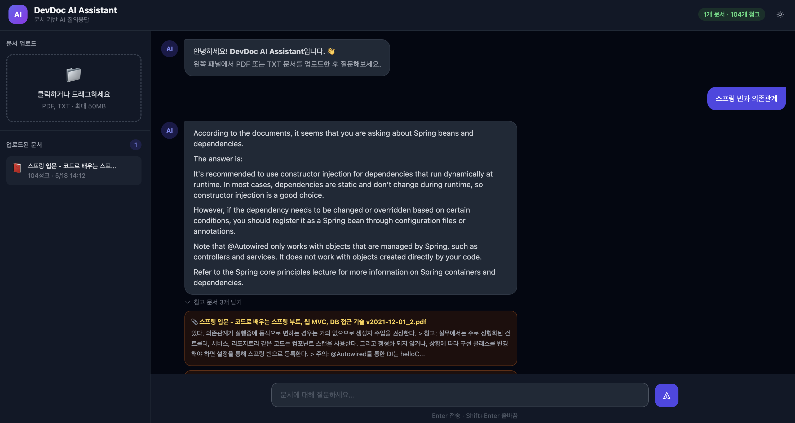

# DevDoc AI Assistant

문서 기반 AI 질의응답 시스템. PDF·TXT 파일을 업로드하면 내용을 벡터화하여 저장하고, 자연어 질문에 문서 내용만을 근거로 답변합니다.

---

## 기능

| 기능 | 설명 |
| --- | --- |
| **파일 업로드** | PDF / TXT 드래그앤드롭 또는 클릭 업로드 (최대 50MB) |
| **RAG 파이프라인** | HuggingFace 임베딩 → FAISS 벡터 검색 → Ollama LLM 답변 |
| **스트리밍 응답** | 토큰 단위 실시간 스트리밍 (SSE) |
| **영속적 벡터 저장** | 재시작 후에도 인덱스 유지 (FAISS + JSON) |
| **문서 관리** | 업로드된 문서 목록 조회 및 삭제 |
| **웹 UI** | 다크모드, 마크다운 렌더링, 출처 인용 |
| **API 키 인증** | 선택적 API 키 보호 |

---

## 예시 화면

### 웹 UI



> PDF 문서를 업로드한 뒤 질문하면 문서 내용을 근거로 스트리밍 답변과 출처 청크를 함께 반환합니다.

---

## 아키텍처

```
[PDF / TXT 업로드]
       ↓
[텍스트 추출 + 청킹]
       ↓
[HuggingFace Embedding (all-MiniLM-L6-v2)]
       ↓
[FAISS 인덱스 (디스크 영속화)]

[질문]
  ↓
[임베딩 → FAISS 유사도 검색]
  ↓
[Ollama (llama3) — 프롬프트 + 컨텍스트]
  ↓
[스트리밍 답변]
```

```
[FastAPI 컨테이너]      [Ollama 컨테이너]
  ├─ 임베딩 (HF)   →    ├─ llama3 모델
  ├─ FAISS 벡터 DB       └─ /api/generate
  ├─ RAG 처리
  └─ Web UI (/static)
```

---

## 프로젝트 구조

```
devdoc-ai/
├── app/
│   ├── main.py          # FastAPI 앱 및 라우터
│   ├── config.py        # 환경 변수 설정
│   ├── models.py        # Pydantic 모델
│   ├── document.py      # PDF/TXT 파싱, 청킹
│   ├── embedding.py     # HuggingFace 임베딩
│   ├── vector_store.py  # FAISS 영속화
│   └── rag.py           # LLM 프롬프트 및 스트리밍
├── static/
│   └── index.html       # 웹 UI
├── data/                # FAISS 인덱스, 메타데이터 (volume)
├── Dockerfile
├── docker-compose.yml
├── requirements.txt
└── .env.example
```

---

## 빠른 시작

### 1. 실행

```bash
cd devdoc-ai
docker compose up --build -d
```

### 2. Ollama 모델 Pull (최초 1회)

컨테이너가 자동으로 모델을 pull 시도하지만, 직접 실행할 수도 있습니다.

```bash
docker exec devdoc-ollama ollama pull llama3
```

### 3. 웹 UI 접속

```
http://localhost:8000
```

### 4. API 문서

```
http://localhost:8000/docs
```

---

## API 엔드포인트

| Method | 경로 | 설명 |
| --- | --- | --- |
| `GET` | `/health` | 상태 확인 |
| `POST` | `/upload` | 파일 업로드 (form-data: `file`) |
| `GET` | `/documents` | 업로드된 문서 목록 |
| `DELETE` | `/documents/{doc_id}` | 문서 삭제 |
| `POST` | `/ask` | 질의응답 (JSON) |
| `POST` | `/ask/stream` | 스트리밍 질의응답 (SSE) |

### 예시

```bash
# 파일 업로드
curl -X POST http://localhost:8000/upload \
  -F "file=@./docs/manual.pdf"

# 질문
curl -X POST http://localhost:8000/ask \
  -H "Content-Type: application/json" \
  -d '{"query": "Redis의 주요 특징은?"}'
```

---

## 환경 변수

`.env.example`을 `.env`로 복사하여 설정합니다.

```bash
cp .env.example .env
```

| 변수 | 기본값 | 설명 |
| --- | --- | --- |
| `OLLAMA_URL` | `http://ollama:11434` | Ollama 서버 주소 |
| `OLLAMA_MODEL` | `llama3` | 사용할 LLM 모델 |
| `CHUNK_SIZE` | `500` | 청크 최대 문자 수 |
| `CHUNK_OVERLAP` | `50` | 청크 겹침 문자 수 |
| `TOP_K` | `3` | 검색할 유사 문서 수 |
| `API_KEY` | *(없음)* | 설정 시 X-API-Key 헤더 필수 |

---

## 기술 스택

- **Backend**: FastAPI, Python 3.10
- **Embedding**: sentence-transformers (`all-MiniLM-L6-v2`)
- **Vector DB**: FAISS (디스크 영속화)
- **LLM**: Ollama (llama3)
- **PDF 파싱**: pdfplumber
- **Frontend**: Vanilla JS + Tailwind CSS CDN
- **인프라**: Docker Compose

---

## 고도화 로드맵

현재 구조에서 상용 서비스 수준으로 발전시킬 수 있는 항목입니다.

### RAG 품질

- **한국어 특화 임베딩 모델 교체** — `all-MiniLM-L6-v2`는 영어 중심 모델. `ko-sroberta-multitask` 또는 `BAAI/bge-m3`로 교체하면 한국어 문서 검색 정확도가 크게 향상됨
- **하이브리드 검색 (BM25 + 벡터)** — 키워드 매칭(BM25)과 의미 검색(벡터)을 결합하는 Reciprocal Rank Fusion 방식으로 정밀도 향상
- **Re-ranking** — FAISS로 후보군을 넓게 뽑은 뒤 Cross-Encoder로 재순위화 (`ms-marco-MiniLM` 등)
- **의미 기반 청킹** — 현재 문자 수 기반 청킹 대신 문단·섹션 구조를 인식하는 청킹 전략 적용
- **멀티턴 대화 지원** — 이전 질문·답변을 프롬프트에 포함해 맥락 유지 (대화 히스토리 API)

### LLM 백엔드

- **다중 LLM 제공자 지원** — `LLM_PROVIDER` 환경변수로 Ollama / OpenAI API / Claude API 전환 가능하도록 추상화
- **프롬프트 캐싱** — Claude API 사용 시 Anthropic Prompt Caching 적용으로 비용·지연 절감
- **LLM 응답 평가** — 답변이 문서 내용에 근거하는지 자동 검증하는 Faithfulness 평가 레이어 추가

### 문서 처리

- **OCR 지원** — 스캔 PDF 및 이미지 기반 문서 처리 (`pytesseract` / `easyocr`)
- **추가 파일 포맷** — `.docx`, `.hwp`, `.md`, `.csv`, `.xlsx` 지원
- **표·이미지 추출** — PDF 내 표를 구조화된 텍스트로 변환, 이미지 캡션 추출
- **대용량 문서 비동기 처리** — Celery + Redis 큐로 백그라운드 처리 후 웹훅 알림

### 벡터 DB

- **ChromaDB / Qdrant 전환** — FAISS는 필터링·메타데이터 검색이 제한적. 프로덕션 규모에서는 필터 기반 검색, 컬렉션 관리가 가능한 전용 벡터 DB 권장
- **문서 버전 관리** — 동일 파일 재업로드 시 기존 청크를 업데이트하는 upsert 전략

### 인증 및 멀티 테넌시

- **JWT 기반 인증** — 현재 단순 API Key에서 사용자별 JWT 발급으로 전환
- **다중 사용자 / 워크스페이스** — 사용자별 문서 공간 분리 (tenant isolation)
- **OAuth2 소셜 로그인** — Google / GitHub 계정 연동

### 성능 및 운영

- **Redis 응답 캐싱** — 동일 질문 재호출 시 LLM 없이 캐시에서 즉시 반환
- **Rate Limiting** — 사용자·IP별 API 요청 제한 (`slowapi`)
- **구조화 로깅 + 트레이싱** — `structlog` + OpenTelemetry로 쿼리 추적 및 디버깅
- **모니터링 대시보드** — Prometheus 메트릭 수집, Grafana 시각화 (응답 지연, 청크 히트율 등)
- **Kubernetes 배포** — Helm chart 작성, HPA(수평 오토스케일링) 설정

### UX

- **피드백 수집** — 답변마다 👍/👎 평가 버튼, 평가 데이터를 DB에 저장해 품질 개선 루프 구성
- **관련 질문 추천** — 답변 아래 "이런 질문도 해보세요" 자동 생성
- **문서 미리보기** — 업로드된 문서의 청크 내용을 UI에서 탐색 가능하도록 구현
- **질문 히스토리** — 사용자별 이전 질의응답 내역 조회 및 북마크
